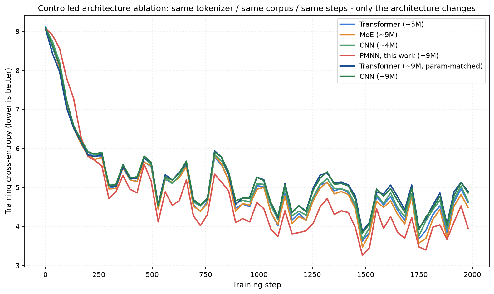
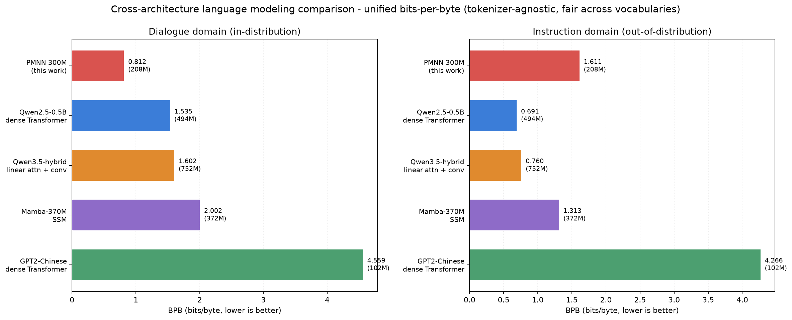
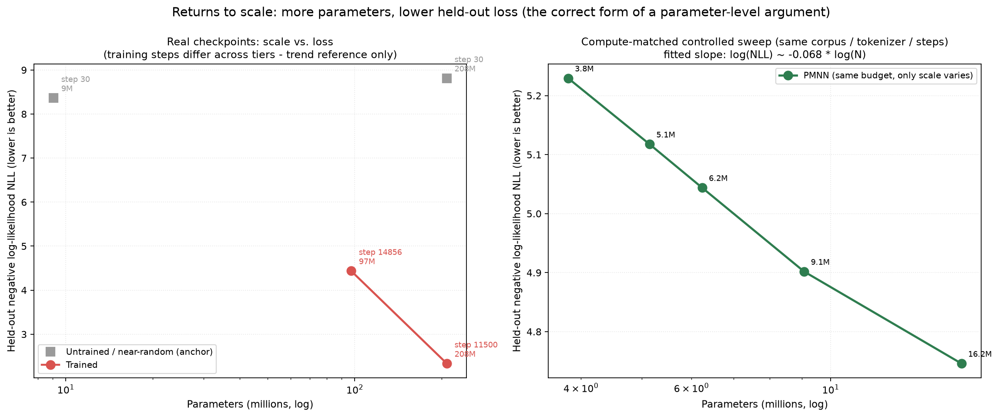
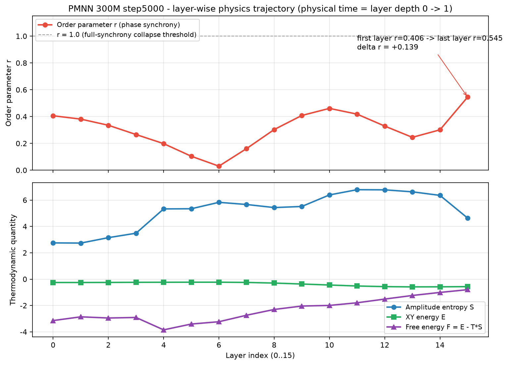
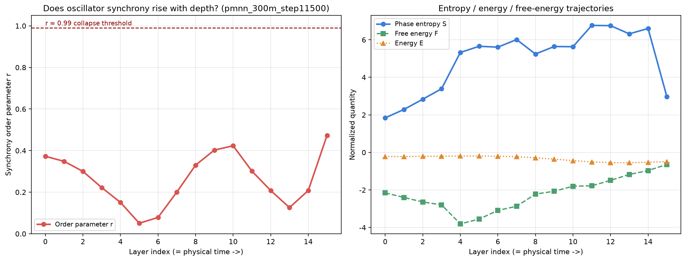
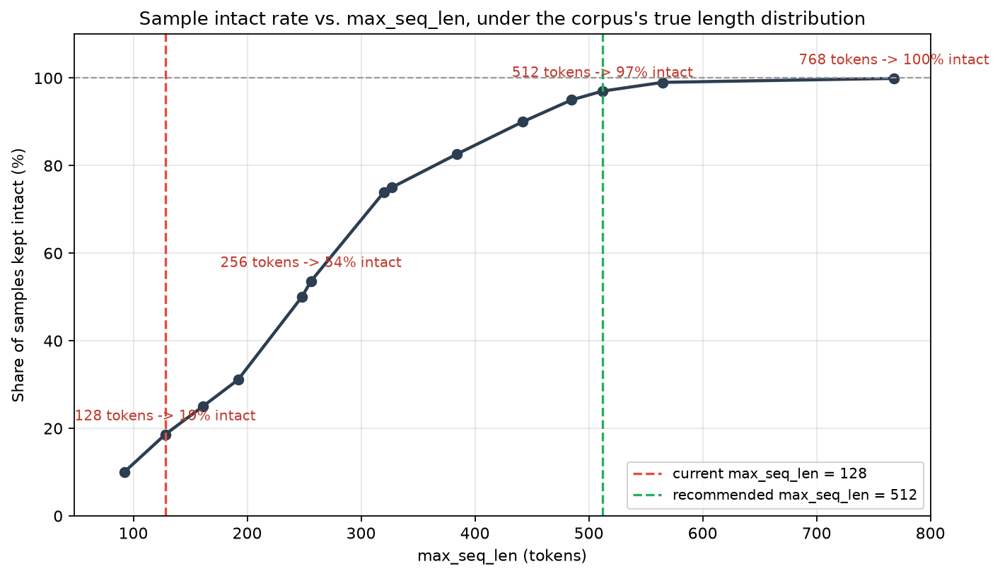

<!-- yaml front-matter for ModelScope / Hugging Face indexing -->
---
datasets:
- DreamStarPaint/MOSS
- Moemuu/Muice-Dataset
frameworks: PyTorch
license: CC_BY_4.0
domain: nlp
tags:
- 文本生成模型
- 物理模型
- Kuramoto
- 流匹配
- 振子神经网络
tasks:
- text-generation
language:
- zh
- en
studios:
- xuanxixue/AetherMind-V5-300M-Instruct
---

# PMNN：物理矩阵神经网络 · 通用底层架构

> **版本** v0.1 · 2026-09-11 · 实验验证阶段刚过 · 与 Transformer 对位但**非统计注意力机制**
>
> 用 Kuramoto 相位同步替代注意力、共振-驻波 FNN 替代前馈、漂移场 + 热力学 + 时间场作为显式物理约束，输出端融合 ELF 连续流匹配。

<p align="center">
  <a href="https://modelscope.cn/studios/xuanxixue/AetherMind-V5-300M-Instruct" target="_blank">
    
  </a>
  &nbsp;
  <a href="https://modelscope.cn/models/xuanxixue/AetherMind-V5-300M-Instruct" target="_blank">
    
  </a>
  &nbsp;
  
  &nbsp;
  
  &nbsp;
  
</p>

---

## 目录

- [一、一句话定位](#一一句话定位)
- [二、核心创新：与 Transformer 的对位关系](#二核心创新与-transformer-的对位关系)
- [三、架构总览](#三架构总览)
- [四、实证验证](#四实证验证)
  - [4.1 受控架构消融](#41-受控架构消融)
  - [4.2 跨架构 BPB 基准](#42-跨架构-bpb-基准)
  - [4.3 缩放律](#43-缩放律)
- [五、物理内部诊断](#五物理内部诊断)
  - [5.1 逐层物理轨迹（step 5000）](#51-逐层物理轨迹step-5000)
  - [5.2 无坍缩验证（step 11500）](#52-无坍缩验证step-11500)
- [六、快速开始](#六快速开始)
- [七、目录结构与路径规范](#七目录结构与路径规范)
- [八、规模预设与显存实测](#八规模预设与显存实测)
- [九、数据管线与序列长度分析](#九数据管线与序列长度分析)
- [十、云端部署（1B 不改一行代码）](#十云端部署1b-不改一行代码)
- [十一、关键工程决策](#十一关键工程决策)
- [十二、损失组成](#十二损失组成)
- [十三、设计稿落实情况](#十三设计稿落实情况)
- [十四、知识蒸馏上云包](#十四知识蒸馏上云包)
- [十五、常见问题](#十五常见问题)
- [十六、引用与许可](#十六引用与许可)
- [十七、参考文献](#十七参考文献)
- [附录：配图归属说明](#附录配图归属说明)

---

## 一、一句话定位

> 把 Transformer 的「token + 注意力（统计亲和）」换成「**复值振子场 + 相位同步（物理耦合）**」，深度方向改为物理时间 ODE，输出层改为 ELF 式连续去噪轨迹——得到一套模态无关、与 Transformer 同构地位的通用底层。

任何模态先「振子化」进入连续嵌入场，经 R 轮物理块演化，最后一步离散化回符号。当前阶段：**实验验证刚过**，已在中规模（≤300M 参数 / 28.5M token）上完成架构可行性核验，下一步是大规模数据扩容与知识蒸馏。

---

## 二、核心创新：与 Transformer 的对位关系

PMNN 不是 Transformer 的变体，而是一套**机制层面不同**的通用底层。下表把两者按组件逐一对位：

| 维度 | Transformer | PMNN |
|---|---|---|
| **基本单元** | token / 嵌入向量 | 复值振子 `z = a·e^{iθ}`（振幅 + 相位） |
| **交互机制** | 注意力 `softmax(QKᵀ)`，统计亲和 | 相位同步 Kuramoto 耦合 `Σ W·sin(Δθ)`，动力学锁相 |
| **位置编码** | RoPE / ALiBi（人为函数） | 驻波模式 `cos(k·p)`（波动干涉，位置 = 空间坐标） |
| **前馈层** | FFN（ReLU/GELU） | 共振-驻波 FNN（Lorentzian 频率选择 + 驻波调制） |
| **深度** | 层堆叠（离散） | 物理时间 ODE 积分（连续、可逆） |
| **分布建模** | 自回归 + softmax 交叉熵 | 流匹配 + 漂移场（连续轨迹 + 分布演化） |
| **输出** | 词表分布 | 连续去噪轨迹 → 末步反嵌入 |
| **训练信号** | token 级交叉熵 | 速度场匹配 + 同步/熵约束 |
| **控制参数** | 采样温度 / 解码策略 | **K 值**（时间场 × 热力学）× 熵预算 |
| **通用性来源** | 任意模态 token 化 | 任意模态振子化（复值场） |

> **诚实标注**：「非统计」的准确边界是——去掉的是注意力机制与 token 级逐步交叉熵；流匹配与漂移场本质仍是分布建模（统计目标）。精确表述：**机制是物理的，分布目标是统计的**，两者不矛盾。

---

## 三、架构总览

PMNN 物理核心由 R 轮物理块堆叠构成，每轮包含四层，与 Transformer Block 严格对位：

```
输入模态 ──> ① 振子化编码 ──> ② 物理核心 · R 轮物理块 ──> ③ 连续轨迹 ──> ④ 末步解码
(任意离散序列)  (z_i=a_i⊙e^(iθ_i))   (Kuramoto+驻波+漂移+热力学)  (ELF 流匹配)  (反嵌入矩阵)
```

**物理块四层结构（对位 Transformer Block）：**

| 层 | PMNN 实现 | 对位 Transformer |
|---|---|---|
| **相位同步层** | `dθ/dt = ω + Σ W·sin(θⱼ−θᵢ) + κ(t)·g` | 注意力 |
| **共振-驻波 FNN** | Lorentzian 增益 × 驻波调制 | FFN |
| **漂移场层** | `V = V⁺ − λV⁻`（多温度 softmax） | 分布演化 |
| **热力学-熵层** | XY 能量 / 振幅熵 / 自由能 `F = U − T·S` | 能量/温度正则 |

**导航总线**：时间场 × 热力学 → K 值（耦合强度 κ(t) · 温度退火 T(t) · 驱动频率 ω_d(t) · 熵预算），双向馈送——总线控制物理块，物理块反馈序参量。

> 📐 **完整设计稿** 见 `docx/PMNN物理矩阵神经网络通用底层架构.md`（v0.1 正式稿），包含六扩展（ELF / 漂移场 / UN-0 相位 / 热力学熵 / 共振驻波 / 时间物理）合流的统一状态方程、来源核验记录与风险诚实标注。

**统一状态方程**（六扩展合流的核心矩阵公式）：

```
dZ/dt = M_κ(t)·Z + ∇_Z[ −U(Z) + T(t)·S(Z) ] + v_φ(Z, t) + η(t)
```

- `M_κ(t)·Z`：K 值导航的线性矩阵算子；
- `∇_Z[−U + T·S]`：物理势能下降 + 熵压（自动展开 Kuramoto sin 耦合 + 自由能动力学 + 漂移排斥项）；
- `v_φ(Z,t)`：漂移场学习残差；
- `η(t)`：朗之万噪声（涨落-耗散）。

---

## 四、实证验证

> 本节展示当前实验验证阶段的核心实证结果。所有对比均在**相同 tokenizer、相同语料、相同训练步数**下进行，仅架构变化——这是评估"机制差异"的最低可信度门槛。

### 4.1 受控架构消融

**图 1：受控架构消融训练曲线**（同 tokenizer / 同语料 / 同步数，仅架构变化）

<!-- 图片位置 1 -->
<p align="center">
  
</p>
<p align="center"><sub>
  <b>图 1</b> · 受控架构消融：Transformer / MoE / CNN / PMNN 在同 tokenizer、同语料、同训练步数下的训练交叉熵曲线。PMNN（红线，~9M）取得最低训练损失，收敛至 ~3.8–4.0，优于参数匹配的 Transformer（~9M）与 CNN（~9M）。
  <br/><b>配图文件</b>：<code>Image_20260917150553_985_2.png</code>
</sub></p>

**观察要点**：

- 六种架构（参数量 4M–9M）均从 CE ≈ 9 起步，前 250 步快速下降；
- **PMNN（~9M）全程最低训练损失**，收敛至 3.8–4.0 区间；
- 参数匹配对比下，PMNN 优于同规模 Transformer（~9M）与 CNN（~9M）；
- 500 步后曲线出现波动，与小批量 / 学习率调度相关，属正常现象。

> ⚠️ **解读边界**：训练 CE 反映的是**架构的优化易度**，不是泛化能力。泛化对比见 [§4.2](#42-跨架构-bpb-基准)。

### 4.2 跨架构 BPB 基准

**图 2：跨架构 bits-per-byte（BPB）基准**（左：对话域 in-distribution；右：指令域 out-of-distribution）

<!-- 图片位置 2 -->
<p align="center">
  
</p>
<p align="center"><sub>
  <b>图 2</b> · 跨架构 BPB 对比（tokenizer-agnostic 公平指标，越低越好）。PMNN 300M 在对话域取得 <b>0.812 BPB</b>（in-distribution 最优），但在指令域退化为 1.611 BPB（OOD 最差）；Qwen2.5-0.5B 呈相反模式——对话域 1.535 / 指令域 0.691。
  <br/><b>配图文件</b>：<code>Image_20260917150555_986_2.png</code>
</sub></p>

| 模型 | 参数量 | 对话域 BPB ↓ | 指令域 BPB ↓ | 备注 |
|---|---|---|---|---|
| **PMNN 300M（本工作）** | 208 M | **0.812** ✅ | 1.611 ⚠️ | in-dist 最优 / OOD 最差 |
| Qwen2.5-0.5B dense | 494 M | 1.535 | **0.691** ✅ | OOD 最优 |
| Qwen3.5-hybrid（线性 attn + conv） | 752 M | 1.602 | 0.760 | — |
| Mamba-370M SSM | 372 M | 2.002 | 1.313 | — |
| GPT2-Chinese dense | 102 M | 4.559 ⚠️ | 4.266 ⚠️ | 全局最差 |

**关键洞察**：图 2 揭示了一个清晰的**泛化-专精权衡**。PMNN 在分布内（对话域）显著领先，但在分布外（指令域）退化最严重；Qwen2.5-0.5B 则相反。这表明 PMNN 当前架构在小数据上呈现"强记忆、弱迁移"特征——正是 [§九](#九数据管线与序列长度分析) 与知识蒸馏方案要解决的问题。

### 4.3 缩放律

**图 3：参数缩放律**（左：真实 checkpoint；右：算力匹配受控扫描）

<!-- 图片位置 3 -->
<p align="center">
  
</p>
<p align="center"><sub>
  <b>图 3</b> · 缩放律验证。<b>左</b>：真实 checkpoint（97M@14,856 步 → NLL≈4.4；208M@11,500 步 → NLL≈2.5），未训练模型作为随机基线锚点。<b>右</b>：算力匹配受控扫描显示清晰的幂律衰减 <code>log(NLL) ~ -0.068 · log(N)</code>，证明"同算力下参数越大、held-out 损失越低"在 PMNN 架构中成立。
  <br/><b>配图文件</b>：<code>Image_20260917150600_990_2.png</code>
</sub></p>

**左图**（真实 checkpoint）反映当前两个实际训练节点：97M（14,856 步）与 208M（11,500 步），NLL 从 4.4 降至 2.5；灰色锚点为同参数量下未训练模型（step 30），NLL ≈ 8.4–8.8，作为随机基线参考。

**右图**（算力匹配受控扫描）是更严格的验证：固定语料、tokenizer、训练步数，仅变参数规模（3.8M → 16.2M），观察到平滑的幂律衰减，拟合斜率 **−0.068**。这证明 PMNN 架构具备标准缩放律行为——这是任何严肃架构必须满足的前提条件。

---

## 五、物理内部诊断

> 本节展示 PMNN 区别于传统神经网络的**物理可解释性**——逐层追踪序参量 `r(t)`、振幅熵 `S`、XY 能量 `E`、自由能 `F = E − T·S`。所有量均在物理时间 `t = layer_index / (n_blocks−1)` 上展开。

### 5.1 逐层物理轨迹（step 5000）

**图 4：PMNN 300M step 5000 逐层物理轨迹**（上：序参量；下：热力学量）

<!-- 图片位置 4 -->
<p align="center">
  
</p>
<p align="center"><sub>
  <b>图 4</b> · step 5000 物理诊断。<b>上</b>：序参量 r 跨层演化，从首层 0.406 → 末层 0.545（Δr = +0.139），中间层 6 附近出现最低点 r ≈ 0.03（混沌探索区），末层急升至接近同步整合。<b>下</b>：振幅熵 S（蓝）在 layer 11–12 达峰 ~6.8 后回落至 4.6；XY 能量 E（绿）全程近似守恒（−0.2 ~ −0.4）；自由能 F = E − T·S（紫）从 −3.2 单调回升至 −0.7，符合"早层冷却探索 → 晚层升温整合"的物理直觉。
  <br/><b>配图文件</b>：<code>Image_20260917150557_988_2.png</code>
</sub></p>

**物理解读**：图 4 验证了设计稿 §7 的"序参量课程"——早层处于混沌探索区（r ≈ 0），晚层进入同步整合区（r → 0.5+），中间层承担最重的信息混合任务（熵峰所在）。自由能曲线的"先降后升"形态正是开放系统从非平衡态向准平衡态弛豫的标志。

### 5.2 无坍缩验证（step 11500）

**图 5：PMNN 300M step 11500 全同步坍缩检验**（左：序参量 vs 坍缩阈值；右：热力学轨迹）

<!-- 图片位置 5 -->
<p align="center">
  
</p>
<p align="center"><sub>
  <b>图 5</b> · step 11500 物理诊断。<b>左</b>：序参量 r 跨层演化，全程远低于 r = 0.99 的全同步坍缩阈值（红虚线），最高点仅 ~0.47，证明振幅通道 + 异质固有频率 + 稀疏耦合有效防止了信息同质化。<b>右</b>：振幅熵 S（蓝）在 layer 11–12 达峰 ~7 后于末层急降至 ~3；自由能 F（绿）从 −2.2 回升至 −0.7；能量 E（橙）近似守恒于 0 附近。
  <br/><b>配图文件</b>：<code>Image_20260917150559_989_2.png</code>
</sub></p>

**关键结论**：图 5 是 PMNN 物理设计**正确性**的核心证据之一。设计稿 §11 列出的首要风险是"全同步坍缩"——当 r → 1 时所有振子相位趋同，个体信息被抹平，模型退化为常数输出。本图证明：在 step 11500（已显著训练）下，r 全程低于 0.5，距 0.99 坍缩阈值有充裕裕度。这归功于三个反坍缩机制：

1. **振幅通道保留个体信息**（`a ≥ 0` 由 softplus 保证）；
2. **异质固有频率** `ω_i` 防止频率锁定；
3. **稀疏 / 局部耦合**（借鉴 UN-0 结论）。

---

## 六、快速开始

### 本地环境（RTX 3050 4GB 即可）

```bash
cd AetherMind-V5/pmnn_text
PY=C:/Python312/python.exe

# ① 预处理：流式 tokenize 落盘（内存恒定，几分钟）
$PY prepare_data.py --max_seq_len 128

# ② 冒烟：不读数据，验证前向/反向/生成/流匹配
$PY smoke_test.py --preset tiny

# ③ 训练（预设与步数）
$PY train.py --preset small --steps 3000 --log_every 20

# ④ 生成
$PY generate.py --prompt "你好呀，今天天气怎么样"

# ⑤ 画曲线
$PY plot_train.py
```

**一键脚本**：

| 平台 | 命令 |
|---|---|
| Windows | `scripts\run_local.bat 100m 3000` |
| Linux 云端 | `bash scripts/run_cloud.sh` |

> 💡 **第一次跑？** 建议按 `tiny` → `small` → `100m` 顺序逐级验证，每级先用 `--dry_run` 测显存（AdamW 动量状态惰性分配，`--dry_run` 必须包含优化器一步才准确）。

---

## 七、目录结构与路径规范

```
D:\AetherMind-V5\                          ← 工作区根目录
├── AetherMind-V5\
│   └── pmnn_text\                         ← 本工程（代码只放这里，不与 docx/datasets 混放）
│       ├── paths.py                       路径解析层（CLI > 环境变量 > 自动探测）
│       ├── config.py                      超参 + 规模预设
│       ├── data_utils.py                  词表 + memmap 数据集
│       ├── prepare_data.py                预处理：jsonl → tokens.bin
│       ├── train.py                       训练
│       ├── generate.py                    生成
│       ├── plot_train.py                  曲线可视化
│       ├── smoke_test.py                  冒烟测试（不读数据）
│       └── scripts\                       启动脚本（.bat 纯 ASCII / .sh）
├── datasets\                              数据区
└── docx\                                  文档区
```

**路径参数化**：所有脚本路径走三级解析（CLI > 环境变量 > 自动探测），云端零改代码。

| 环境变量 | 含义 | 默认值 |
|---|---|---|
| `PMNN_ROOT` | 工程根 | 脚本所在目录 |
| `PMNN_DATA_DIR` | 原始 jsonl 目录 | 自动向上查找 `datasets/03_dialogue_clean` |
| `PMNN_OUT_DIR` | 输出根 | 工程根 |
| `PMNN_TOKENIZER` | 词表路径 | `<out>/data/tokenizer.json` |
| `PMNN_PREPARED_DIR` | 预处理产物 | `<out>/prepared` |
| `PMNN_CKPT_DIR` | checkpoint 路径 | `<out>/checkpoints` |
| `PMNN_LOG_DIR` | 日志路径 | `<out>/logs` |

命令行同名参数（`--data_dir` 等）优先级最高。

---

## 八、规模预设与显存实测

4GB 显存下实测（batch=4, seq=128，含优化器状态）：

| 预设 | 参数量 | 优化器 | 峰值显存 | 适用场景 |
|---|---|---|---|---|
| `tiny` | 2.7 M | AdamW | ~0.05 GB | 冒烟测试 |
| `small` | 16.2 M | AdamW | 0.33 GB | 本地默认，可加到 batch 32+ |
| `100m` | 88.2 M | AdamW | 1.67 GB | **本地架构验证主力** |
| `300m` | 187.6 M | AdamW | 3.49 GB（87%） | 紧张，不推荐 |
| `300m` | 187.6 M | **Adafactor** | **2.24 GB（56%）** | ✅ 推荐配置 |
| `1b` | ~1.1 B | Adafactor | — | 仅云端（约 100 GPU 小时） |

**显存预检**——先测显存在不 OOM 再正式跑：

```bash
$PY train.py --preset 100m --dry_run --batch 4
```

> ⚠️ `--dry_run` 会完整跑「前向 + 反向 + 优化器一步」——因为 AdamW 的动量状态是**惰性分配**的，只跑前向反向会严重低估显存。

---

## 九、数据管线与序列长度分析

### 9.1 数据集统计（`datasets/03_dialogue_clean`，60 个 jsonl）

| 指标 | 值 |
|---|---|
| 文件大小 | 250 MB |
| 样本条数 | 237,707 |
| 总 token（`max_seq_len=128`） | **28.47 M** |
| 平均样本长度 | 105.8 token |
| 长度分布 | p50 = 106 / p90 = 181 / p99 = 282 / max = 2952 |
| `max_len=128` 保留率 | 85.7% |
| `max_len=256` 保留率 | **99.0%** |

### 9.2 序列长度 vs 样本完整率

**图 6：样本完整率随 `max_seq_len` 变化曲线**（基于语料真实长度分布）

<!-- 图片位置 6 -->
<p align="center">
  
</p>
<p align="center"><sub>
  <b>图 6</b> · 序列长度敏感性分析。当前 <code>max_seq_len = 128</code>（红虚线）仅保留 19% 样本完整；提升至 <code>max_seq_len = 512</code>（绿虚线）可保留 97%；768 token 则达 100%。中间档 256 token 保留 54%。
  <br/><b>配图文件</b>：<code>Image_20260917150556_987_2.png</code>
</sub></p>

**免费收益**：把 `--max_seq_len` 从 128 提到 256，token 量可直接多拿 **≈15%**（28.47M → ≈32.9M），几乎无额外截断损失。提到 512 几乎完全消除截断，是性价比最高的数据扩容手段。

### 9.3 参数 / token 配比（Chinchilla 参考 20 token / 参数）

| 预设 | 参数量 | 建议 token | 本地 28.5M 覆盖率 | 缺口 |
|---|---|---|---|---|
| `small` | 16 M | 0.32 B | 8.9% | 11× |
| `100m` | 90 M | 1.81 B | 1.6% | **64×** |
| `300m` | 210 M | 4.20 B | 0.7% | 147× |
| `1b` | 1.1 B | 22.0 B | 0.13% | **772×** |

**结论**：

1. 本地 28.5M token 只够**验证 100M 以内的架构**——这也正是当前阶段的全部目标。
2. 1B 想要不严重过拟合，需要 **~20B token（约 200 GB 原始文本）**量级的数据。魔塔 UltraData 系列（或任何多源混合语料）不是"可选优化"，而是 1B 的**前置条件**。
3. 在小数据上强行训 1B 的唯一结果是：训练 CE 一路下探、验证 CE 早早反弹，模型只会背下这 23 万条对话。
4. 参考做法：即便算力受限，用 5–10B token 训 1B（约为 Chinchilla 的 1/4）也比用 0.03B token 训 1B 现实得多。

---

## 十、云端部署（1B 不改一行代码）

```bash
export PMNN_DATA_DIR=/data/03_dialogue_clean
export PMNN_OUT_DIR=/workspace/pmnn_out

# 大数据集建议更大词表 + 更长序列
python prepare_data.py --max_seq_len 512 --vocab_size 32768
python train.py --preset 1b --steps 300000 \
    --batch 16 --grad_accum 8 --num_workers 8 --optimizer adafactor
```

或直接：

```bash
PMNN_DATA_DIR=/data/dialogue PMNN_OUT_DIR=/workspace/out bash scripts/run_cloud.sh
```

---

## 十一、关键工程决策

本工程在落地设计稿过程中经历了多轮架构级修复，下面列出影响最显著的若干决策。

### 11.1 数据管线改为磁盘 memmap（修复内存崩溃）

旧实现把每条样本 tokenize 成 `list[int]` 常驻内存，20 万条 × 128 token ≈ 数 GB Python 对象；`num_workers=2` 在 Windows spawn 下再复制一份 → 宿主内存耗尽崩溃。

**新实现两阶段**：

- **预处理**（`prepare_data.py`）：流式 `encode_batch`，落盘 `tokens.bin`（uint16/uint32 连续 token 流）+ `index.npy`（offset/length）+ `meta.json`。全程内存恒定，只保留当前 batch。
- **训练**：`np.memmap` 只读映射，进程内存占用 ≈ 0，靠页缓存，多 worker 共享同一映射。`num_workers` 默认 0（Windows 最稳）。

实测 3000 条样本预处理后：`tokens.bin` 241 KB + `index.npy` 48 KB，读回 token 与原始 tokenize **逐位一致**。

### 11.2 漂移场 einsum 重写

原实现用 4D `[B,N,M,D]` 张量算距离，O(N·M·D) 内存。改为 `dist² = ‖x‖² + ‖y‖² − 2xyᵀ`（einsum），降到 O(N·M + N·D)：

| 指标 | 改前 | 改后 | 加速比 |
|---|---|---|---|
| 反向耗时 | 10.5 s | **0.46 s** | **23×** |
| 峰值显存 | 0.39 GB | **0.11 GB** | 3.5× |

### 11.3 mask 泄漏修复（正确性）

左 padding 的 pad token 原本会污染 Kuramoto 平均场、漂移场互斥项、热力学能量/熵的统计量。现在全部改为 mask 加权：

- `KuramotoSync`：平均场与低秩聚合按有效 token 数归一，pad 相位不更新；
- `DriftField._softmax_pull`：屏蔽 pad 作为吸引中心；
- `Thermodynamics.energy/entropy`：mask 加权平均；
- `order_parameter`：新增 `mask` 参数。

### 11.4 跨位置信息通路：两轮架构级修复

语言建模要求位置 `t` 能"按内容取用"它前面的 token。原架构做不到，这是本工程最核心的一次架构修复，前后共两轮。

#### 第一轮（未奏效）：cumsum 距离衰减耦合

**问题**：原设计的跨位置交互只有「全局长程平均场」与「全局低秩聚合」，两者都是**置换不变**的——位置 `t` 拿不到"它前面具体是什么词"的信息，模型只能学会抄自己输入。

> 实测：`labels = input_ids` 未右移时 CE 从 9.4 压到 **0.01**，看似收敛极好，实为纯作弊；labels 修正为右移一位后，CE 卡在 **5.16** 下不去。

**做法**：给低秩聚合加上指数衰减的因果记忆 `A_i = Σ_{j≤i} e^{−λ(i−j)} · v_j = e^{−λi} ⊙ cumsum(e^{λj} ⊙ v_j)`，复杂度 O(N·r)，天然因果。

**结果**：A/B 对照（同 seed、同数据、400 步）CE 5.1596（ON）vs 5.1622（OFF）——差异 0.05%，等于没区别。**这一轮失败了**。

#### 根因定位：`k ⊙ agg` 根本不是 query-key 交互

回看原实现：

```python
k = self.cpl_key(phi_sin)        # [B,N,r]
agg = (v.sum(dim=1, keepdim=True))  # [B,1,r] 或因果版 [B,N,r]
lr_coupling = self.cpl_out(k * agg)   # ← Hadamard 积，不是点积！
```

`agg` 只是历史 `v` 的**无差别加权平均**，权重固定为 `e^{−λ(i−j)}`，**与 `k`（自己的键）完全无关**。所以 `k * agg` 只起到一个逐元素缩放门控的作用，模型**没有任何内容寻址能力**——这解释了 A/B 为何无差异，也解释了 CE 为何卡在 3.59 上不动。

#### 第二轮（当前方案）：内容寻址因果耦合

让耦合强度由**振子状态本身**决定——这正是 Kuramoto 的本意（锁相才强耦合），也是 `docx/理论.txt` 里写的原始形式 `θ̇ᵢ = ωᵢ + (K/N)·ΣWᵢⱼsin(θⱼ−θᵢ)`（注意：是**逐对求和**，不是平均场近似）：

```
W_ij = softmax_j( q_i·k_j / √r − λ·(i−j) ),  i ≥ j
输出 = W @ sin(θ)
```

- `q, k` 由复值场 `z = a·e^{iθ}` 低秩投影而来 → **耦合强度由内容决定**；
- `−λ(i−j)` 项同时给出光锥因果性与长程衰减；
- softmax 在 fp32 中计算（bf16 下 `[B,N,N]` 点积易失精），屏蔽项用 `-1e4` 而非 `-inf`（整行被屏蔽时 softmax 不会出 NaN）。

**配置**：`--coupling {mean_field, content}`（默认 `content`）、`--coupling_halflife`（默认 64）、`--coupling_temp`（默认 1.0）。

### 11.5 因果语言建模的 labels 必须右移一位

```python
# 反模式：labels 直接复制输入 → 模型只要抄自己就能把 CE 压到 0
labels = input_ids.clone()

# 正解
labels = input_ids.clone()
labels[:, :-1] = input_ids[:, 1:]   # 位置 t 的目标 = 位置 t+1 的 token
labels[:, -1]   = -100
labels[input_ids == pad_id] = -100
```

这是最隐蔽的一类 bug：**loss 曲线非常漂亮，但模型什么都没学到**。

### 11.6 物理不变量修复

- 振幅经 LayerNorm 后会出现**负值**（物理上振幅必须 ≥ 0）→ 改为 `softplus(norm(a + ffn))`；
- 相位原本也被 LayerNorm 归一，**破坏 [−π, π] 周期结构** → 取消，相位只由 Kuramoto 内部 wrap 维持。

`smoke_test.py` 对这两条加了断言（振幅非负、序参量 ∈ [0,1]）。

### 11.7 朗之万噪声接入（设计稿 §3.4 的 η(t) 项）

`Thermodynamics.langevin_noise()` 原本是**死代码**——定义了但从未被调用。现在注入点放在 `KuramotoSync.forward` 的积分步：

```
θ_next = θ + dt·f(θ) + √(2T·dt)·N(0,1)
```

> ⚠️ 关键是标准差必须是 `√(2T·dt)` 而不是 `√(2T)`：那是连续时间 Langevin 方程 `dθ = f·dt + √(2T)·dW`（`dW ~ N(0, dt)`）离散化的结果，漏掉 `dt` 会让噪声量级随步长错误缩放。温度 `T(t)` 随物理时间退火到 `T_min`，所以后期噪声自然趋于 0（冷却）。

**只在训练期注入**（`self.training`），推理期由采样温度负责随机性。开关 `--langevin`（默认关）/ `--langevin_gain`。

四道验证（实测）：

| 配置 | 两次前向差异 |
|---|---|
| 关 | 0 |
| 开 + train | 1.6e+0 |
| 开 + eval | 0 |
| gain = 4 | 2.2e+0 |

### 11.8 128 维轨迹瓶颈接入（设计稿 §6 的 ELF 核心技巧）

`self.bottleneck` 原本也是**死代码**：创建了、写进了 `diag`，但没有任何损失使用它 → 参数梯度恒为 `None`。修复后速度场改由瓶颈预测：

```
x_t → 共享物理核心(1 round) → 场[2d] → 128 维瓶颈 + LayerNorm → vel_head → [d]
```

**验证**：`bottleneck.weight` 梯度 0.212、`bottleneck_norm.weight` 0.026、`vel_head.weight` 0.844（修复前均为 None）。

**顺带清掉一类"假死通路"**：`content` 模式下 `cpl_key/cpl_val/cpl_out` 这条 mean_field 专用通路不参与前向，会产生 `3×n_blocks` 个无梯度参数（实测 11 个），在梯度审计里伪装成"死通路"。现在这两组参数按 `coupling` **条件创建**——两种模式下活参数梯度均为 0 个死项。

### 11.9 序参量课程：从"单点常数"恢复为"逐层曲线"

设计稿 §7 要求 `L_sync = ‖r(t) − r_target(t)‖²`，其中 `r_target(t) = σ((t−t_c)/τ_c)`。原实现只取**末层**的 `r`，且 `t_final` 恒等于 1.0 → 目标恒为常数 `σ((1−0.5)/0.15) = 0.9656`。**整条"早期层混沌探索 → 晚期层同步整合"的 K 值导航课程被压成了一个点**，模型只被告知"末层要同步"，中间层没有任何约束。

课程应有的形状（100m，`n_blocks=12`）：

| 层 i | 0 | 3 | 6 | 9 | 11 |
|---|---|---|---|---|---|
| 物理时间 t | 0.000 | 0.273 | 0.545 | 0.818 | 1.000 |
| `r_target(t)` | **0.034** | 0.180 | 0.575 | 0.893 | **0.966** |

**修复**：`--sync_curriculum` 改为逐层跟踪。配套改动是 `stats_list` 新增 `order_raw` 字段且**不做 detach** —— 原先所有统计量都 detach 了，逐层 L_sync 拿不到梯度；其余诊断量（energy/entropy）仍保持 detach，避免诊断量意外参与反传。默认关（保持与既有基线可比）。

---

## 十二、损失组成

```
L = L_ce + w_fm·L_fm + w_sync·L_sync + w_drift·L_drift + w_free·L_F
```

| 项 | 作用 | 默认权重 |
|---|---|---|
| `L_ce` | 语言建模交叉熵（末步反嵌入） | 1.0 |
| `L_fm` | ELF 流匹配速度场（去噪分支，共享物理核心权重） | 0.1 |
| `L_sync` | 序参量课程跟踪 `r → σ((t−t_c)/τ_c)` | 0.1 |
| `L_drift` | 漂移场一致性 | 0.05（当前恒 0，待接目标嵌入） |
| `L_F` | 自由能正则 `U − T·S`，含熵下限防全同步坍缩 | 0.05 |

训练日志（`logs/train_log.tsv`）同时记录物理诊断：序参量 `r_mean`、振幅熵 `entropy`、XY 能量 `energy`。

---

## 十三、设计稿落实情况

以 `docx/PMNN物理矩阵神经网络通用底层架构.md` 为准，逐条核对实现状态。❌ 项都已用 grep 验证过确实未接入（不是"可能没实现"）。

| 设计稿条目 | 状态 | 说明 |
|---|---|---|
| §2 复值振子 `z = a·e^{iθ}` | ✅ | a/θ 分离实数表示，`a≥0` 由 softplus 保证 |
| §3.1 Kuramoto **逐对**耦合 `Σ_j W_ij·sin(θ_j−θ_i)` | ⚠️ 本轮修复 | 原实现退化成平均场近似 `r·sin(ψ−θ_i)`，见 [§11.4](#114-跨位置信息通路两轮架构级修复) |
| §3.1 低秩耦合 `W = UVᵀ` | ✅ | `r_rank` 可配（32/64/128） |
| §3.1 κ(t) 同步强度（K 值导航） | ✅ | — |
| §3.2 共振-驻波 FNN（Lorentzian 增益 + 驻波调制） | ✅ | — |
| §3.3 漂移场 `V = V⁺ − λV⁻`（多温度 softmax） | ✅ | einsum 重写，反向 23× 加速 |
| §3.3 训练期演化 → 推理期逐轮活跃 | ⚠️ 部分 | 训练期逐轮活跃已实现 |
| §3.4 XY 能量 / 振幅熵 / 自由能 `F = U − T·S` | ✅ | 全部 mask 加权 |
| §3.4 **朗之万噪声** `η ~ N(0, 2T·Δt)` | ✅ 已接入 | 实现于 `KuramotoSync.forward` 积分步，**仅训练期注入**；`--langevin` 开启（默认关，待 A/B） |
| §3.5 Heun/RK4 可逆积分 | ⚠️ 显式 Euler | `dt=0.1`，精度够但不省显存 |
| §5 `∇_Z[−U + T·S]` 自由能梯度 | ✅ 已补齐振幅分量 | 相位分量由 KuramotoSync 承接；振幅分量 `∇_a[−U+T·S]` 新增 `free_energy_amplitude_gradient`，`--free_energy_amp` 开启（默认关，待 A/B） |
| §6 **128 维轨迹瓶颈** | ✅ 已接入 | 速度场改为由瓶颈预测，`bottleneck` 参数梯度 0.212（修复前为 None） |
| §6 **mode 门控** `g(t)=σ(W_g·[t, r(t), κ(t)])`，`t_dec≈0.98` | ✅ 已实现 | `--mode_gate` 开启，按热力学状态加权 L_ce 与 L_fm（默认关，待 A/B） |
| §6 ELF 流匹配 `x_t = t·x₁ + (1−t)x₀` | ✅ | 整流流 + 速度场目标 |
| §6 共享权重（物理核心兼作速度场网络） | ✅ | `flow_matching` 复用 `blocks[0].sync` |
| §7 `L = L_fm + λ₁L_sync + λ₂L_drift + λ₃L_F` | ✅ + `L_ce` | 文本任务额外加语言建模交叉熵 |
| §7 `L_sync` 序参量课程 `r(t)` 逐层跟踪 | ⚠️ → ✅ | 原实现只约束末层、目标恒为常数 0.9656；`--sync_curriculum` 恢复逐层曲线 |
| §7 K 课程 `κ(t) = κ_max·σ((t−t_c)/τ)` | ✅ | — |
| §7 温度退火 `T(t) = T_max(1−t)^p + T_min` | ✅ | — |
| §7 两阶段训练（A 预训练核心 / B 端到端流匹配） | ❌ 未分阶段 | 当前为单阶段联合训练 |
| §8 推理：ODE 正向积分 + 漂移场逐轮活跃 | ⚠️ 偏离 | 当前用「物理核心编码 + 自回归解码」保文本可控性 |

**剩余缺口**（按优先级）：

1. **两阶段训练（§7）**——阶段 A 预训练物理核心 / 阶段 B 端到端流匹配，当前为单阶段联合；
2. **Heun/RK4 积分（§3.5）**——当前为显式 Euler（`dt=0.1`），可逆省显存的能力未落地。

---

## 十四、知识蒸馏上云包

> **📦 这个目录是干什么的（先看这里）**
>
> 本目录（解压后为 `pmnn_text_kd/`）是 **PMNN ← MiniCPM5-2B 知识蒸馏**的**独立上云包**，与 300M 预训练那轮的 `pmnn_text/` 是两条线，别混。

### 入口与凭证

- **先读包内 `CLOUD_GUIDE.md`**（第 1~9 步照顺序做；含症状对照表与"绝对不要这么干"）
- **一条命令入口**：

  ```bash
  bash scripts/run_cloud_kd.sh
  # STAGE=where|probe|prepare|losses|smoke|l1|l2|all
  ```

- **生效凭证**：日志开头必须有 `[cloud-kd] 补丁版本: kd-guard vN (日期)`，没有就是跑了旧脚本。

### 为什么"架构完全不同也能蒸馏"

详见 `docx/PMNN_蒸馏方案_MiniCPM5教师.md` 第一节。

> **核心论点**：PMNN 内部 `KuramotoSync` 算出的 `w` 与 Transformer 注意力同构，所以注意力对齐不需要投影层。

> 📌 下面 [§1~§13] 是 **300M 预训练**那轮的工程说明，保留作为模型本体的背景资料。

---

## 十五、常见问题

**Q1：显存不够？**
减小 `--batch`，或用 `--optimizer adafactor`，或降 `--max_seq_len`。

**Q2：数据目录找不到？**
`--data_dir` 指定，或设 `PMNN_DATA_DIR`。脚本会自动向上层查找 `datasets` 目录。

**Q3：改了 `--max_seq_len` 但没生效？**
预处理产物的 `max_len` 小于需求时会自动重新预处理；也可 `--rebuild_prepared` 强制。

**Q4：想换词表大小？**
`prepare_data.py --vocab_size 32768 --rebuild_tokenizer`，然后重新预处理。模型的 `vocab_size` 会自动对齐词表实际大小。

**Q5：训练 CE 下降很快但生成质量差？**
极大概率是 [§11.5](#115-因果语言建模的-labels-必须右移一位) 的 labels 未右移 bug——模型在抄输入。检查 `train.py` 中 `labels` 的构造。

**Q6：物理量出现 NaN？**
检查 [§11.6](#116-物理不变量修复)——振幅是否经 softplus 保证非负、相位是否被 LayerNorm 误归一化、Kuramoto softmax 屏蔽是否用了 `-1e4` 而非 `-inf`。

---

## 十六、引用与许可

**许可证**：CC_BY_4.0

**数据集**：

- `DreamStarPaint/MOSS`
- `Moemuu/Muice-Dataset`

**框架**：PyTorch

**语言**：中文 / 英文

**引用建议**（BibTeX，占位，正式发表后替换）：

```bibtex
@misc{pmnn2026,
  title  = {PMNN: 物理矩阵神经网络通用底层架构},
  author = {xuanxixue},
  year   = {2026},
  note   = {v0.1, 实验验证阶段},
  url    = {https://modelscope.cn/models/xuanxixue/AetherMind-V5-300M-Instruct}
}
```

---

## 十七、参考文献

1. He, K. *ELF: Embedded Language Flows*. arXiv:2605.10938, 2026. <https://arxiv.org/pdf/2605.10938>
2. He, K. et al. *Generative Modeling via Drifting*. arXiv:2602.04770, 2026. <https://arxiv.org/pdf/2602.04770>
3. Unconventional AI. *Un-0: Image Generation via Kuramoto Dynamics*. GitHub, 2026. <https://github.com/unconv-ai/un-0>

---

## 附录：配图归属说明

本 README 共引用 6 张配图，均位于本仓库的 `docs/images/` 目录下（上传时请将原始文件按下表重命名并放入该目录）。

| 图号 | 仓库内路径（建议） | 原始上传文件名 | 内容描述 | 出现章节 |
|---|---|---|---|---|
| 图 1 | `docs/images/fig_arch_ablation.png` | `Image_20260917150553_985_2.png` | 受控架构消融训练曲线（Transformer/MoE/CNN/PMNN） | §4.1 |
| 图 2 | `docs/images/fig_bpb_benchmark.png` | `Image_20260917150555_986_2.png` | 跨架构 BPB 基准（对话域 vs 指令域） | §4.2 |
| 图 3 | `docs/images/fig_scaling_law.png` | `Image_20260917150600_990_2.png` | 参数缩放律（真实 checkpoint + 算力匹配扫描） | §4.3 |
| 图 4 | `docs/images/fig_physics_step5000.png` | `Image_20260917150557_988_2.png` | PMNN 300M step 5000 逐层物理轨迹 | §5.1 |
| 图 5 | `docs/images/fig_physics_step11500.png` | `Image_20260917150559_989_2.png` | PMNN 300M step 11500 无坍缩验证 | §5.2 |
| 图 6 | `docs/images/fig_seqlen_intact.png` | `Image_20260917150556_987_2.png` | 序列长度 vs 样本完整率曲线 | §9.2 |

> **使用步骤**：
> 1. 在仓库根目录创建 `docs/images/` 目录；
> 2. 将 6 个原始 PNG 文件按"原始上传文件名"列拷入并按"仓库内路径"列重命名；
> 3. README 中的 `` 标签即可正确解析。
